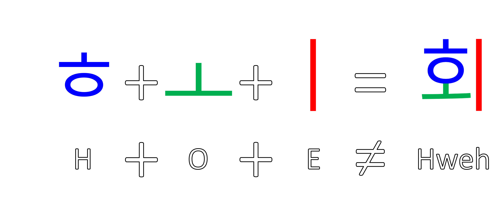

# Let's Talk about Young Hoe... and the Problem with Korean Dipthongs
You know, Younghoe Koo, the kicker for the Atlanta Falcons? Koo is the first Korean NFL player since Hines Ward, and his given name is a low-hanging source of memes and jokes.

But his name isn't pronounced the way you think it is. Well, the first syllable is. Young is young. Or rather, 영 is Young. The second syllable, 회 or Hoe, is pronounced more like "hweh". think Stewie Griffin's "cool hwip" sound...

And the second part "eh" sounds like "meh", making "hweh".

## If sounds like "hweh", why is it spelled "hoe"?
This is where dipthongs come in. A dipthong is the combination of two vowels in a single syllable. The korean syllable 회 is made of three characters: 

Korean | ㅎ | ㅗ | ㅣ 
--- | --- | --- | ---
English | H | O | E
<!-- Korean Pronunciation | H | Oh | E | -->

which immediately betrays the reason for the "hoe" spelling. But the ㅚ dipthong makes the "hweh" sound instead of the "oh" sound that you think when you see the "oe" dipthong.

Similarly, 최 or Choi is a common Korean surname that often gets mispronounced, as in "choice". But the correct pronunciation is similar to Younghoe Koo's "hweh", but with a "ch" sound to make "chweh". This is a mouthful syllable that even Koreans often neglect to enunciate perfectly. Nevertheless, it sounds nothing like the "hoe" sound you expect when you see Younghoe Koo's name.

